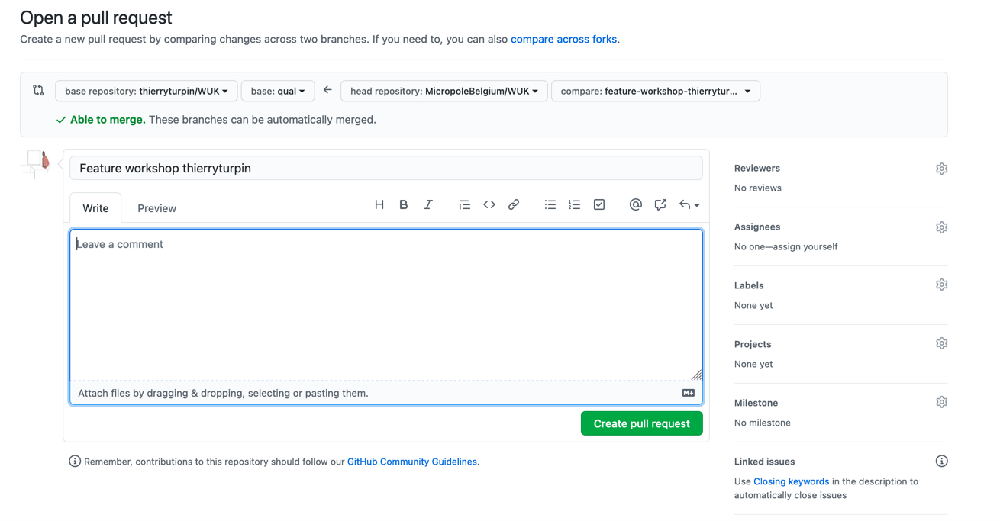
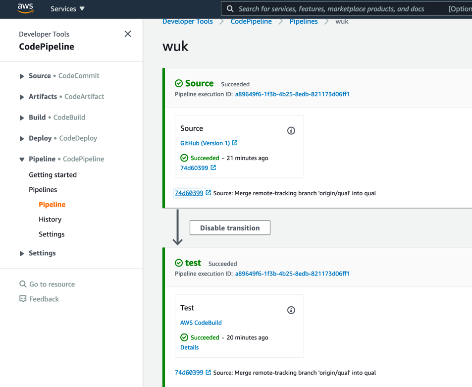

## EMR DIY

start ssm session
```
ec2="i-038fb5e2df183ce42" # WUK
aws ssm start-session --target $ec2 --profile=micropole --region=eu-west-1
```

Create your OS user
```
sudo su - ec2-user
sudo adduser thierryturpin
sudo su - thierryturpin
```

Clone the repository, providing your PAT credentials
```
git clone https://<<your git username>>@github.com/MicropoleBelgium/WUK.git

```

Switch to the `qual` branch
```
git checkout remotes/origin/qual
```

Create your feature branch
```
git checkout -b feature-workshop-thierryturpin
```

Create your PySpark script

Verify all your modified scripts and stage your work
```
git status
```

example
```
git status
On branch feature-workshop-thierryturpin
Changes not staged for commit:
  (use "git add <file>..." to update what will be committed)
  (use "git restore <file>..." to discard changes in working directory)
	modified:   README.md
```

stage your modified files

commit and push your work (update your username & mail if needed)
```
git commit -m "just a small update of the README"
git push --set-upstream origin feature-workshop-thierryturpin
```

goto: https://github.com/MicropoleBelgium/WUK
open a pull request and describe your work:

```
base repository         base        <--     head repository         compare
thierryturpin/WUK       qual        <--     MicropleBelgium/WUK     <<your feature branch>>
```



After your work is merged into the qual branch of thierryturpin/WUK codepipeline is triggered, and your work is promoted to the EMR cluster

**note** Codepiline mentions the **Source** this should reference your work


## Submit and EMR step using AWS CLI
...

modify the following statement so that:
* your script is used under: `/home/hadoop/sparkscripts/`
* your name is included in the step name

```bash
aws emr add-steps --cluster-id $myEMR --profile=micropole --region=eu-west-1\
                  --steps Type=Spark,\
                    Name="<<your_name>>__myPysparkscript", \
                    ActionOnFailure=CONTINUE, \
                    Args=[--deploy-mode,cluster,--conf,spark.yarn.appMasterEnv.PYSPARK_PYTHON=python3.7,--conf,spark.executorEnv.PYSPARK_PYTHON=python3.7,/home/hadoop/sparkscripts/<<your_python_script>>.py,-cs3n://dih2018/extract_audiences.csv,-d/home/hadoop/sparkscripts/csv_to_parquet.yml]

```

Verify the execution of your PySpark job executed on EMR  
* in the AWS console
* via the Yarn logs


